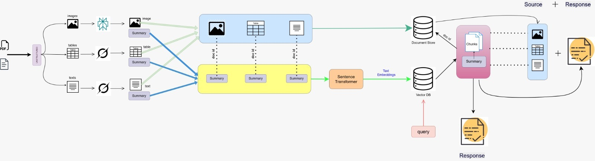

# 📄 Semantic Multimodal RAG System

An end-to-end **Semantic Search--based Retrieval Augmented Generation
(RAG) application** built using **Streamlit, LangChain, ChromaDB,
HuggingFace embeddings, Groq LLM, and Perplexity API**.

This system enables **document-grounded question answering** over **PDF
and DOCX files**, supporting **text, tables, and images**, while
strictly minimizing hallucinations by forcing answers to be generated
**only from retrieved document context**.

------------------------------------------------------------------------

## 🚀 Key Features

• Multimodal document understanding (Text, Tables, Images)\
• Semantic vector-based retrieval\
• Multi-vector (parent--child) indexing strategy\
• Multi-question decomposition and answering\
• Strict context-only answer generation\
• Streamlit-based interactive UI

------------------------------------------------------------------------

## 🧠 System Overview

The application follows a research-grade RAG pipeline:

1.  User uploads multiple documents (PDF / DOCX)
2.  Documents are parsed into structured elements
3.  Text, tables, and images are summarized
4.  Summaries are embedded into a vector database
5.  Parent documents are stored for full-context recovery
6.  User queries are semantically matched
7.  Retrieved context is injected into an LLM prompt
8.  Final answers are generated without external knowledge

------------------------------------------------------------------------

## 📂 Architecture\Workflow

------------------------------------------------------------------------

## 📂 Project Structure

frontend\
• Streamlit application interface

extraction\
• PDF and DOCX parsing logic

summarization\
• Text and table summarization (Groq)\
• Image summarization (Perplexity Vision)

rag\
• Vector store setup\
• Multi-vector retriever\
• RAG chain construction

perplexity_api\
• API wrapper for Perplexity LLM

------------------------------------------------------------------------

## 🔍 Retrieval Design

The system uses **semantic similarity search only**, avoiding keyword or
lexical matching.

A **MultiVectorRetriever** is used: • Child documents contain summarized
chunks (embedded) • Parent documents contain full original content • A
shared document ID links both

This design ensures: • Fast semantic retrieval • Complete context
availability • Reduced hallucination risk

------------------------------------------------------------------------

## 🖼️ Multimodal Support

Text: • Extracted and summarized using Groq LLM

Tables: • Converted to HTML • Summarized before embedding

Images: • Encoded to base64 • Summarized using Perplexity Vision API •
Safely validated and size-checked

------------------------------------------------------------------------

## ❓ Multi-Question Handling

User queries containing multiple questions are automatically split. Each
sub-question is: • Retrieved independently • Answered independently •
Returned in a structured format

------------------------------------------------------------------------

## 🛡️ Hallucination Control

The system enforces: • Context-only prompting • No pretrained knowledge
usage • No answer generation without retrieved context • Explicit LLM
instructions to avoid assumptions

This makes the system suitable for **academic, research, and evaluation
use cases**.

------------------------------------------------------------------------

## 🖥️ User Interface

The Streamlit UI allows users to: • Upload multiple documents • Choose
answer mode (response only / response with source) • Ask natural
language questions • View grounded answers

Documents are indexed only once per session for efficiency.

------------------------------------------------------------------------

## ⚙️ Environment Setup

Python virtual environment is recommended.

Environment variables required: • GROQ_API_KEY • PERPLEXITY_API_KEY

These must be stored in a `.env` file.

------------------------------------------------------------------------

## ▶️ Running the Application

Start the Streamlit app and open it in a browser. The system runs fully
locally except for LLM API calls.

------------------------------------------------------------------------

## 🎯 Use Cases

• Research paper question answering\
• Technical documentation analysis\
• Academic project demonstrations\
• Multimodal knowledge bases\
• RAG interview and viva preparation

------------------------------------------------------------------------

## 🔮 Future Enhancements

• Cross-encoder reranking\
• Agent-based query planning\
• Persistent vector databases\
• OCR for scanned PDFs\
• UI-level citation highlighting

------------------------------------------------------------------------

## 📌 Summary

This project demonstrates a **clean, explainable, and production-aligned
RAG architecture** with strong emphasis on: • Retrieval correctness\
• Multimodal reasoning\
• Hallucination reduction\
• Interview-readiness

It is ideal for demonstrating **deep understanding of modern RAG
systems**.